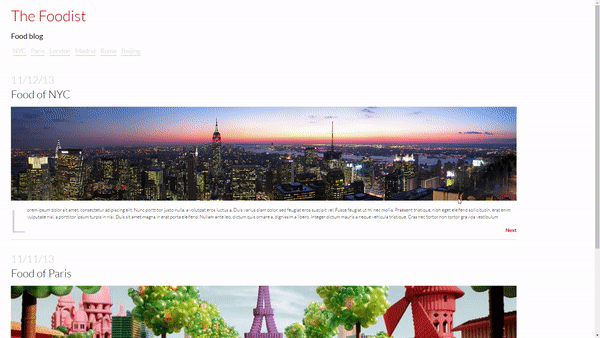

# The-Foodist-Blog

A static mirror of The Foodist Blog

Link to project: https://the-foodist-template.netlify.app/

## How It's Made:

Tech used: HTML, CSS

I used HTML and CSS to create a static mirror of The Foodist Blog. I built the basic structure of the content with HTML, using sections and articles as needed semantically. I used CSS to style the content.

## Lessons Learned:

This was my first experience creating a mirror of a website. I learned about making the correct semantic decisions for the elements and content. 